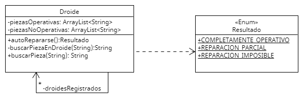

## ENUNCIADO

Hace mucho tiempo, en una galaxia muy lejana, había muchos droides que formaban parte de la existencia cotidiana de todos. Algo particular unía a todos esos droides: la capacidad que tenían de auto repararse. Ante algún desperfecto, podían reemplazar la o las piezas que no estaban funcionando por otras (con el mismo nombre) para seguir operando.
Para esto, cada droide llevaba un registro detallado de las piezas que lo componían, manteniéndolas por separado entre piezas operativas y no operativas. Cada una de estas piezas tiene un nombre (String) que es el mismo en todos los droides (por ejemplo, “Batería de litio”, “Sensor de proximidad”, 
“Visor nocturno”, etc). 
Siempre que un droide encontraba a otro droide fuera de servicio (luego de batallas o simplemente por el uso) lo registraba para así, de ser necesario, usar las piezas sanas de éste para repararse. Al necesitar una pieza buscaba entre los droides rotos que tenía registrados, chequeando si encontraba entre ellos las piezas sanas que necesitaba. De encontrarlas, reemplazaba sus piezas no operativas por las operativas encontradas en los otros droides.

Basado en el enunciado descripto, realizá:
1. El diagrama de clases que lo modelice, con sus relaciones, atributos y métodos.
2. La explotación del método autoRepararse de la clase Droide, que no recibe parámetros. Debe intentar reemplazar sus piezas no operativas por las piezas operativas que pudiera encontrar en alguno de los otros droides. Cada vez que una pieza se reemplaza la pieza no operativa original se descarta. Este método devuelve alguno de estos resultados:
- COMPLETAMENTE_OPERATIVO: cuando todas las piezas del droide están operativas.
- REPARACION_PARCIAL: cuando quedan algunas piezas no operativas, pero alguna se pudo reemplazar.
- REPARACION_IMPOSIBLE: cuando no se logre reparar ninguna de las piezas no operativas que pudiera tener

# DIAGRAMA UML

