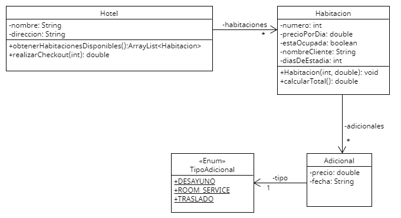

## ENUNCIADO

Un prestigioso hotel, del que sabemos el nombre, la dirección y las habitaciones que tiene, nos
encomienda un sistema. De cada habitación sabemos el número, el precio por día y, si está ocupada,
el nombre del cliente y la cantidad de días de estadía. Cada habitación puede tener adicionales, los
cuales tienen un precio, fecha de prestación y un tipo (Desayuno, Room Service o Traslado).

Basado en el enunciado descripto, realizá:

1. El diagrama de clases que lo modelice, con sus relaciones, atributos y métodos.
2. El constructor parametrizado de la clase Habitacion, que recibiría como parámetros el
número y el precio por día.
3. La explotación del método calcularTotal de la clase Habitacion, que devuelve el total en
base al valor de la habitación por los días que se hospede el cliente y los adicionales pedidos.
4. La explotación del método obtenerHabitacionesDisponibles de la clase Hotel que debe
devolver una lista con aquellas habitaciones que no estén ocupadas en la actualidad.
5. La explotación del método realizarCheckout de la clase Hotel, que recibe como
parámetro el número de habitación y debe hacer lo siguiente:
- Verificar que la habitación existe y esté ocupada actualmente.
- Devolver el monto a abonar para dicha habitación.
El método devolverá -1 si no se pudiera realizar el checkout1
(por no encontrar la habitación
enviada como parámetro o no estar ocupada).

### DIAGRAMA UML

